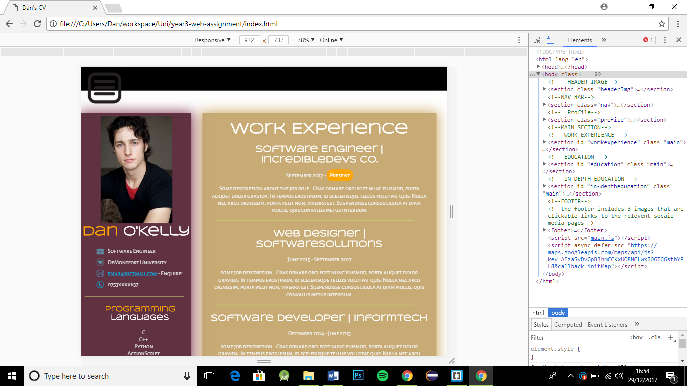

# IMPORTANT! #
  to ensure it * RESIZES * correctly as you change the window size, please use the device toolbar (ctrl + shift + M) in chrome (also found in the inspect element development tools area) as im using min-device-width as appose to min-width in the @media tag.
  
  ### pre-development designs: ###
  #### Mobile design ####

 #### Tablet design ####

 #### Desktop design ####

### Post-development ###
#### mobile ####

#### tablet ####

#### desktop ####
