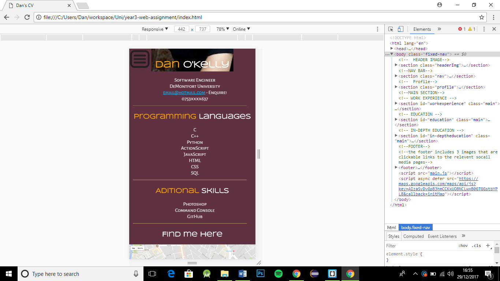

# IMPORTANT! #
  to ensure it RESIZES correctly as you change the window size, please use the device toolbar (ctrl + shift + M) in chrome (also found in the inspect element development tools area) as im using min-device-width as appose to min-width in the @media tag.
  
  ### pre-development designs: ###
  #### Mobile design ####

 #### Tablet design ####

 #### Desktop design ####

### My Plan ###
My plan is to develop a single page site that's a CV. It'll contain a navigation bar at the top that scrolls/jumps to the right heading selected.

I'll include a side bar that will have the main profile of the persons CV. Then in the majority of the page they'll be the main container for the persons information such as their work experience and education.

### Post-development ###
#### mobile ####

#### tablet ####

#### desktop ####

## User testing ## 
I asked a few people to look at mywebsite once I uploaded it to Github Pages and sent them the link. This was especially useful to double check the tablet sizing as I don't own a tablet myself. Unfortunatly as I did this over the Christmas period I wasn't able to video them looking at it. But the feedback was mostly positive and I made adjustments where appropriate.